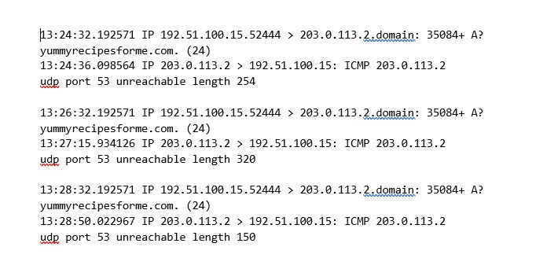

# DNS Server Unavailability: Investigating UDP Port 53 Unreachable Error

## Introduction
The DNS Port 53 Unreachable Analysis project is a comprehensive investigation into a specific network issue encountered while accessing a website. The repository provides detailed logs and network captures. This is used to analyze the DNS and ICMP traffic, aiming to identify the underlying problem causing the unavailability of the DNS server.

## Objectives
1. Identify the affected network protocol: Determine which network protocol (e.g., UDP, TCP) is causing the "UDP port 53 unreachable" error, leading to the DNS server unavailability.
2. Analyze DNS and ICMP traffic: Utilize network analyzer tools (e.g., tcpdump) to capture and analyze the DNS and ICMP packets, examining the source, destination IP addresses, timestamps, and error messages.
3. Determine the root cause: Investigate the logs and network captures to identify the underlying issue causing the unavailability of the DNS server, such as misconfigurations, network blocks, or potential malicious activities.

## Skills / Concepts Demonstrated
1. Network Traffic Analysis.
2. Log Analysis.
3. Network Security Awareness
4. Problem Solving.

## Background Information 
You are a cybersecurity analyst working at a company that specializes in providing IT consultant services. Several customers contacted your company to report that they were not able to access the company website www.yummyrecipesforme.com, and saw the error “destination port unreachable” after waiting for the page to load. 

You are tasked with analyzing the situation and determining which network protocol was affected during this incident. To start, you visit the website and you also receive the error “destination port unreachable.” Next, you load your network analyzer tool, tcpdump, and load the webpage again. This time, you receive a lot of packets in your network analyzer. The analyzer shows that when you send UDP packets and receive an ICMP response returned to your host, the results contain an error message: “udp port 53 unreachable.” 

**__Task:__** : Your task is to inspect and review the log file generated from using the network protocol analyzer, tcpdump to investigate the error, and determine the possible causes of the incidents. 

## Review of Log File

**__Note__**: The log file is showing 3 attempts made to access the server.

First attempt record:
- The record, 13:24:32.192571 displays the time 1:24 p.m. and 32.192571 seconds. This is showing when the event happened. 
- Nest is the source and destination IP address. In the error log, this information is displayed as: 192.51.100.15.52444 > 203.0.113.2.domain. The source IP address is 192.51.100.15.52444 and the destination IP address is 203.0.113.2.domain. 
- The second and third lines of the log show the response to the initial ICMP request packet. In this case, the ICMP 203.0.113.2 line is the start of the error message indicating that the ICMP packet was undeliverable to the port of the DNS server.
- Next are the protocol and port number, which displays which protocol was used to handle communications and which port it was delivered to. In the error log, this appears as: udp port 53 unreachable. This means that the UDP protocol was used to request a domain name resolution using the address of the DNS server over port 53. Port 53, which aligns to the .domain extension in 203.0.113.2.domain, is a well-known port for DNS service. The word “unreachable” in the message indicates the message did not go through to the DNS server. The source computer's browser was not able to obtain the IP address for yummyrecipesforme.com, which it needs to access the website because no service was listening on the receiving DNS port as indicated by the ICMP error message “udp port 53 unreachable.”

Similar information is displayed in the subsequent records.

